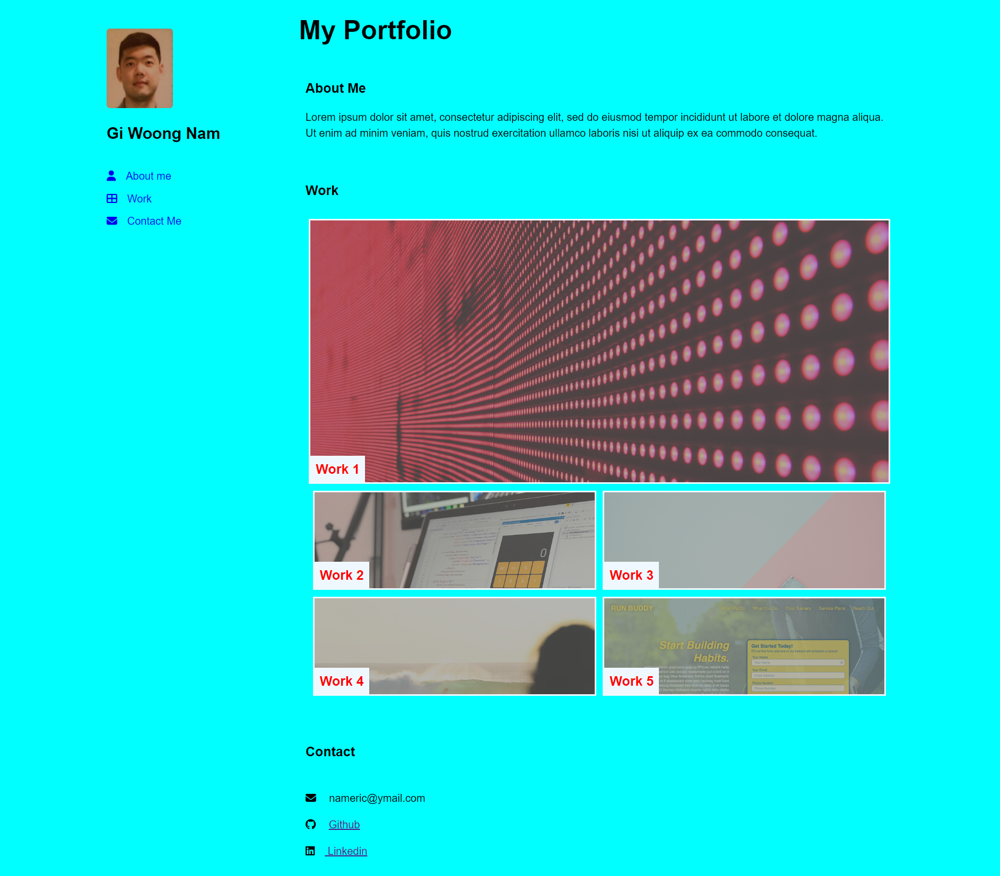

# Portfolio-of-Challenges

## Description

The motivation of this portfolio project is to create web application from scratch. The key factor of this project is understanding and applying the skill of flexbox, media queries, and CSS variables. Since this is long term project, the web application will be constantly updated with the new skills applied throughout the course of the coding bootcamp. The goal of this project is to apply the core skills and meet the criteria for the future job application.

## Work Done

- Created semantic html elements.

- Made aside element fixed to the web so it dose not move while .scrolling down

- configured the nav link so UI scrolls to corresponding section.

- added margine-left=300px for individual parents elements so it doesn't hide behind aside element.

- worked on the hover function so when I hover on the links the color changes.

## Links

- [Link to the website](https://namgiwoong.github.io/Portfolio-of-Challenges/)
- [Link to the repository](https://github.com/namgiwoong/Portfolio-of-Challenges)

## Usage

Application can be viewed in the desk web browser. 980px of website width supported

## Credits

References

- https://www.w3schools.com/html/html5_semantic_elements.asp
- https://developer.mozilla.org/en-US/docs/Glossary/Semantics
- https://css-tricks.com/a-complete-guide-to-links-and-buttons/
- https://fontawesome.com/search?s=solid%2Cbrands
